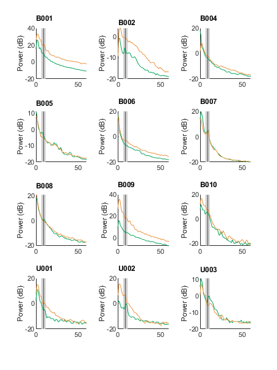
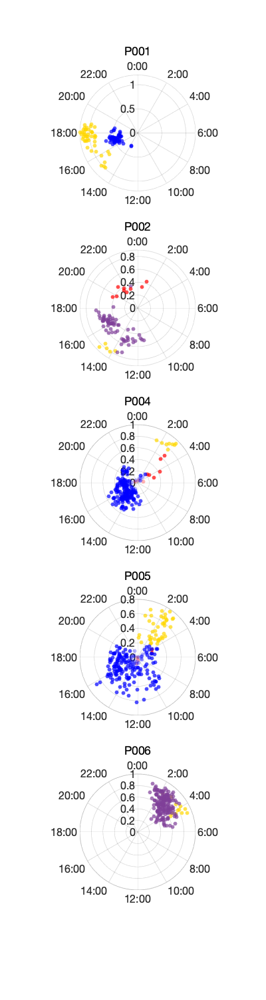
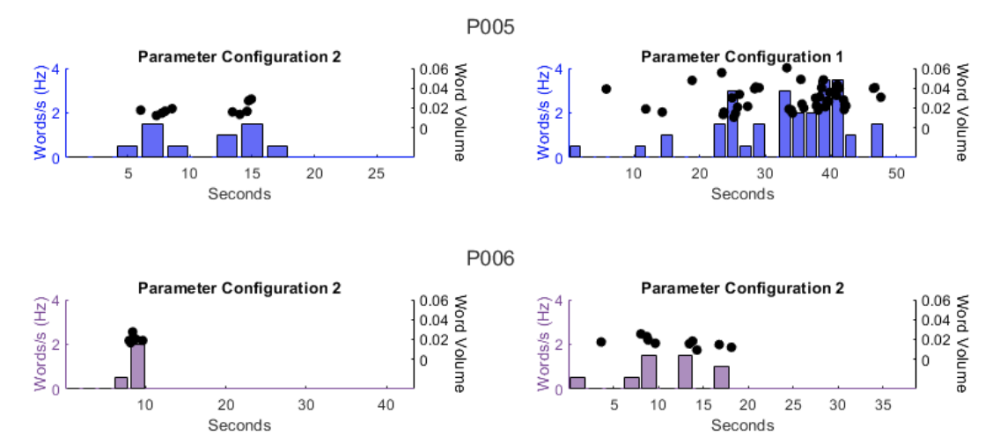
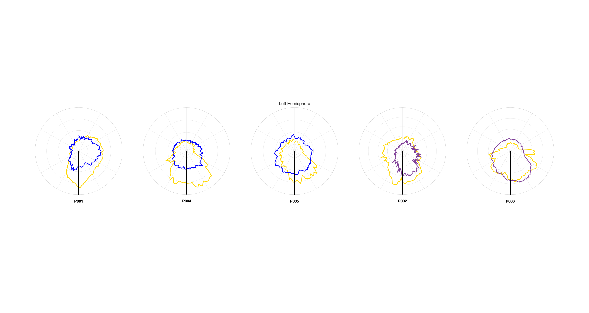
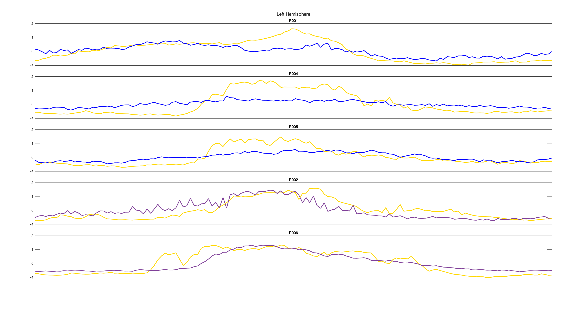
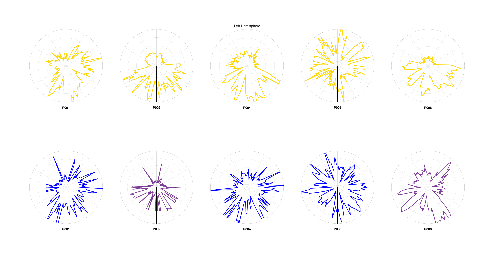
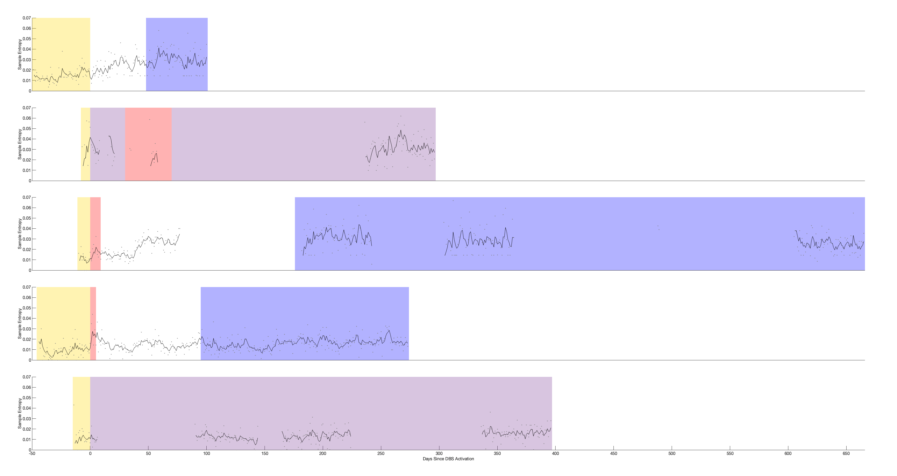
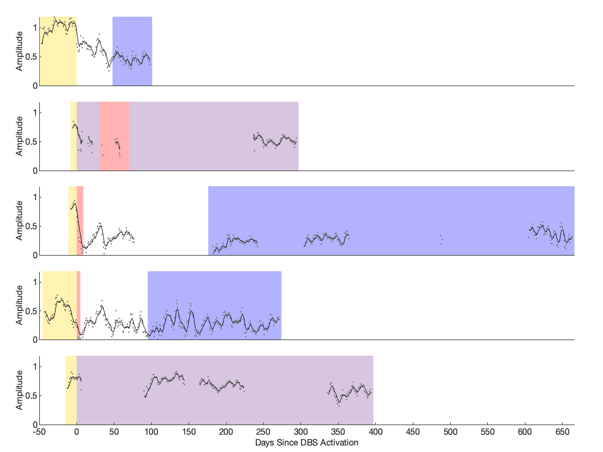
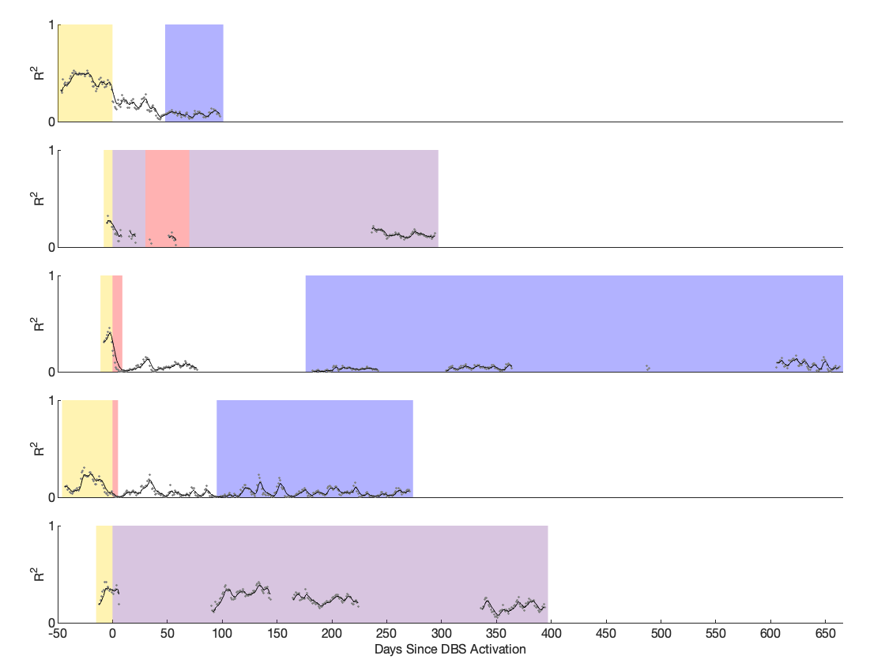
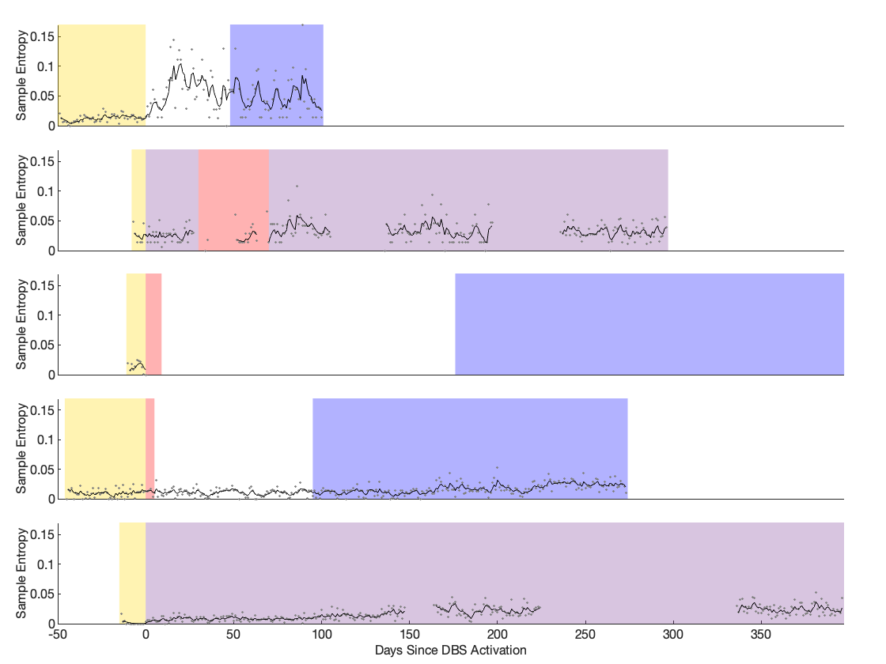

# PerceptDataAnalysis
Details of Code involved in the analysis of data from Medtronic Percept PC


# System Requirements
## Hardware requirements
package requires only a standard computer with enough RAM to support the in-memory operations.

## Software requirements
### OS Requirements
This package is supported for Windows 11. The package has been tested on the following systems:
+ Windows 11

### Python Dependencies
```
numpy == 1.24.3
pandas == 2.0.2
openpyxl == 3.1.2
matlabengine == 9.14.3
scikit-learn == 1.2.2
EntropyHub == 0.2
plotly == 5.14.1
kaleido == 0.1.0
```

### MATLAB Dependencies

System requirements:
All MATLAB code run on version 2022b using Windows 11
Windows Requirements: https://www.mathworks.com/content/dam/mathworks/mathworks-dot-com/support/sysreq/files/system-requirements-release-2022b-windows.pdf

Installation guide:
Mathworks MATLAB 2022b: https://www.mathworks.com/downloads
    ~30 minute installation
Respective version of the Signal Processing Toolbox: https://www.mathworks.com/products/signal.html
    ~5 minute installation
EntropyHub Toolbox v0.2: https://github.com/MattWillFlood/EntropyHub
    ~5 minute installation
    

# Code Instructions for Use and Demonstrations
Below are instructions for generating each of the code-based figures in the paper sequentially. For all figures, axis and other aesthetic adjustments were completed on Adobe Illustrator. All Figure code contained in Github folder "figure_scripts". Demo data and figures in DEMO folder.

## Raw Data Extraction

## Data Preparation

Download “demo_data.mat” Open dataprep.m and adjust the load path to “demo_data.mat” in the code. Run code. Expected run time ~2 minutes for included demo_data file. Outputs of running are saved in “demo_data_prepped.mat” and “demo_data_prepped1day.mat” (included as separate demo files for convenience in running the demonstrations). 

## Figure 1
Panel A: generated via Lead-DBS as described in the methods section.

Panel B: download data file "streamsplot.mat" into a folder accessible by MATLAB. Open figure1.m and edit directories to match those corresponding to your local machine for “streamsplot.mat”, then run the code. 


Demo:


 


(Runtime ~1-3 seconds)


## Figure 2

Panels A-D are copyrighted artist illustrations.

Panel E-F:

Download “demo_data_prepped.mat” into a folder accessible by MATLAB. Adjust the load directory in the code to load the above noted file. Run figure2.m

Demo:




## Figure 3

Stills and raw audio trace not shared. Download “audioinfo.mat” into a folder accessible by MATLAB. Adjust the load directory in the code to load the file, and run the program figure3.m. Runtime ~1 second. 

Demo:




## Figure 4
Template plots: Download “demo_data_prepped_1day.mat” and “singleDayTemplateDates.mat” into the appropriate load directory on the local machine. Run figure4.m. The last 3 figures correspond to the dates shown as representatives of the first, second and third quartiles respectively. Demo figure 3 below shows only the example 3rd quartile plots (5th plot generated by code). Expected run time 3.5s

Demo:






Violin Plots (python code): Allow python access to the directory in which the  “demo_data_prepped_1day.mat” is stored and run plot_violin_entropy.py.

## Figure 5
Panel A: Download “demo_data_prepped_1day.mat” into a folder accessible by MATLAB. Adjust the load directory in the code to load the above noted file.Run figure5.m. Runtime ~1 second

Demo:




Panel B: Made entirely through shapes and text in Adobe Illustrator.


## Figure S1
Download “demo_data_prepped.mat” and adjust load directory for MATLAB to access file. Run figureS1.m Runtime ~1 second.


## Figure S2
Download “demo_data_prepped.mat” and adjust load directory for MATLAB to access file. Run figureS2.m Runtime ~1 second.

Demo:





## Figure S3
Download “demo_data_prepped.mat” and adjust load directory for MATLAB to access file. Run figureS3.m Runtime ~1 second.

Demo:




