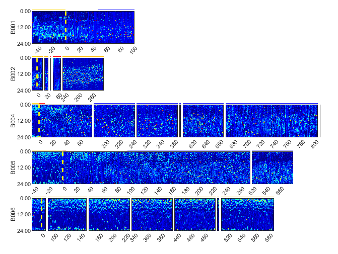

# PerceptDataAnalysis
Details of Code involved in the analysis of data from Medtronic Percept PC


# System Requirements
## Hardware requirements
This package requires only a standard computer with enough RAM to support the in-memory operations. If running the nonlinear AR analysis, a modern Nvidia GPU is heavily recommended. Estimated code execution times were determined on a system with a Ryzen 9 7950x CPU and RTX 4090 GPU.

## Software requirements
## OS Requirements
This package is supported for Windows 11. The package has been tested on the following systems:
+ Windows 11

## Python Dependencies
```
numpy == 1.24.3
pandas == 2.2.0
pytorch == 2.1.0
matlabengine == 23.2.1
scikit-learn == 1.2.0
statsmodels == 0.14.1
matplotlib == 3.8.2
plotly == 5.14.1
kaleido == 0.1.0.post1
scipy == 1.10.1
```

## MATLAB Dependencies
```
System requirements:
All MATLAB code run on version 2022b using Windows 11
Windows Requirements: https://www.mathworks.com/content/dam/mathworks/mathworks-dot-com/support/sysreq/files/system-requirements-release-2022b-windows.pdf

Installation guide:
Mathworks MATLAB 2022b: https://www.mathworks.com/downloads
    ~30 minute installation
Respective version of the Signal Processing Toolbox: https://www.mathworks.com/products/signal.html
    ~5 minute installation
EntropyHub Toolbox v0.2: https://github.com/MattWillFlood/EntropyHub
    ~5 minute installation
AUROC Matlab Package: https://github.com/alistairewj/auroc-matlab/tree/master
    ~5 minute installation
```

# Code Demo
Demo datasets and and a script to generate demo outputs are located in the DEMO folder. Run the demo ("demo.m") script section-by-section to view how each step of analysis is conducted. For all figures, axis and other aesthetic adjustments were completed on Adobe Illustrator. 

# Workflow
Below are instructions for generating each of the code-based figures in the paper sequentially for your own data. All figure and table-generating codes are contained in Github folder "CircadianPaper". 

## 1. Raw Data Extraction
Run the function "generate_data" (type "help generate_data" in the command window for specific function operation). Select the .json files and indicate both date of DBS onset and patient label when required. Output will be of equivalent form to that stored in demo_data.mat.
    -Estimated runtime: 5-20s per patient depending on data quantity

## 2. Circadian Calculations
Run the function "calc_circadian" (type "help calc_circadian" in the command window for specific function operation) on the output struct generated from step 1. This function uses MATLAB to calculate cosinor and sample entropy metrics, and then passes the data to python to generate autoregressive metrics and perform classification testing. A current limitation of this code is that it re-runs all data every time, so processing time will get cumulatively longer with more subjects and data added. IMPORTANT NOTE: permutation testing and the nonlinear AR (neural network) model are incredibly slow to run, so in most cases they should be skipped. This occurs by default, and the user must manually provide an optional input to run these analyses (see "help calc_circadian").
    - Estimated runtime (no permutation or nonlinear AR): 30-60s per patient depending on data quantity
    - Estimated runtime (permutation and/or nonlinear AR): >24hr

# Figures and Tables

## Figure 1
Run the function "plot_PSD" (type "help plot_PSD" in the command window for specific function operation). This requires a manually-created field in the percept_data called "streams," which is an nx3 cell array (same structure as percept_data.days) where n is the number of patients. Column 1 should be the patient name, column 2 should be left hemisphere signal, and column 3 should be right hemisphere signal. Each signal should be a 1D vector of either BrainSense Streaming time-domain data (>100 samples) or BrainSense Survey pre-calculated PSDs (must equal 100 values).
    - Estimated runtime: 1-3 seconds


 
## Figure 2/Extended Data Figure 1
Heatmaps: Run the function "plot_heatmap" (type "help plot_heatmap" in the command window for specific function operation).
    - Estimated runtime: 3-5 seconds

Cosinor Polar Plots: Run the function "plot_cosinor" (type "help plot_cosinor" in the command window for specific function operation).
    - Estimated runtime: 1-3 seconds




## Figure 3/4
Daily "Template" Polar Plots: Run the function "plot_templates" (type "help plot_template" in the command window for specific function operation). Note that the final plot is a median-average of all days in a particular zone.

Raw data and metrics over time: Run the function "plot_metrics" (type "help plot_metrics" in the command window for specific function operation). The manuscript uses python-generated violin plots instead of MATLAB for aesthetics (see "Figure S2/S3" section).
    - Estimated runtime: 3-5 seconds


## Figure 5
Run the function "plot_deltas" (type "help plot_deltas" in the command window for specific function operation).
    - Estimated runtime: 3-5 seconds
    


## Extended Data Figure 2/3
Run the function ___ (Python code for visual aesthetics) to generate violin plots for both Supplementary Figures 2 and 3. 
    - Estimated runtime: 10-15 seconds


## Extended Data Tables 1-5 (Cohort 1 results in 1-4, Cohort 2 results in 5)
Calculates two-sample, two-tailed Welch’s t-test statistics between parameters of the various model fits for pre- vs. post-DBS periods. This also calculates stationarity of signals in the pre-DBS and chronic clinical states using the Augmented Dickey-Fuller and Kwiatkowski–Phillips–Schmidt–Shin tests if a second output variable is specified. 

Run the function "calc_significance" (type "help calc_significance" in the command window for specific function operation), change the second input parameter to the metric of interest (Cosinor, linear AR, nonlinear AR, or sample entropy) and change the final input parameter from 0 to 1 to correct for effective sample size.
    - Estimated runtime: 1-3 seconds

## Extended Data Table 6

Calculates two-sample two-tailed Welch’s t-test statistics for the period in which patients had high symptom burden (i.e., pre-DBS and persistent OCD symptoms post- DBS) vs. the period with low symptom burden (i.e., post-DBS clinical response) using cosinor R2, linear AR R2, nonlinear AR R2, and sample entropy (per-day). Analysis pooled across patients and conducted with either corrected or uncorrected sample size as before.

Run the function "calc_pooled_significance" (type "help calc_pooled_significance" in the command window for specific function operation) and change the final input parameter from 0 to 1 to correct for effective sample size.
    - Estimated runtime: 1-3 seconds

## Extended Data Table 7
Calculates ROC classifier performance metrics. This is already located in the percept_data struct under the variables "ROC_metrics" after running step 2 of the workflow.

## Supplemental Table 1
Calculates F-test statistics for a single cosinor fit across the entire pre-DBS period. Run the function "calc_preDBS_cosinor" (type "help calc_preDBS_cosinor" in the command window for specific function operation).
    - Estimated runtime: 3-5 seconds

## Supplemental Table 2
Calculates DeLong test statistics on pairwise ROC comparisons. Run the function "calc_delong" (type "help calc_delong" in the command window for specific function operation).
    - Estimated runtime: 3-5 seconds

## Supplementary Video
Run the script "plot_video" (type "help plot_video" in the command window for specific function operation). This generates a video of the patient's treatment course over time, with three metricd (Cosinor R2, linear AR R2, and sample entropy) plotted and background shading representing treatment status. Above these timelines is plotted the daily template.


